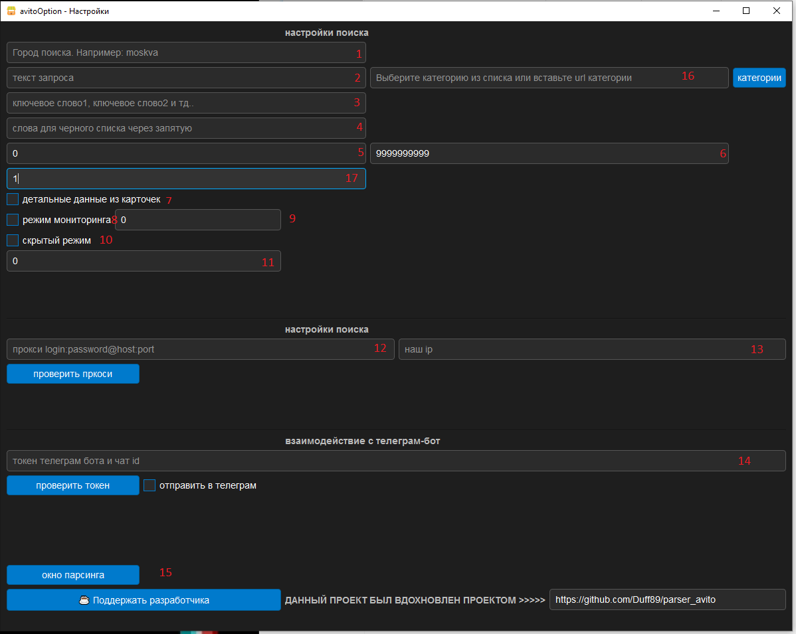
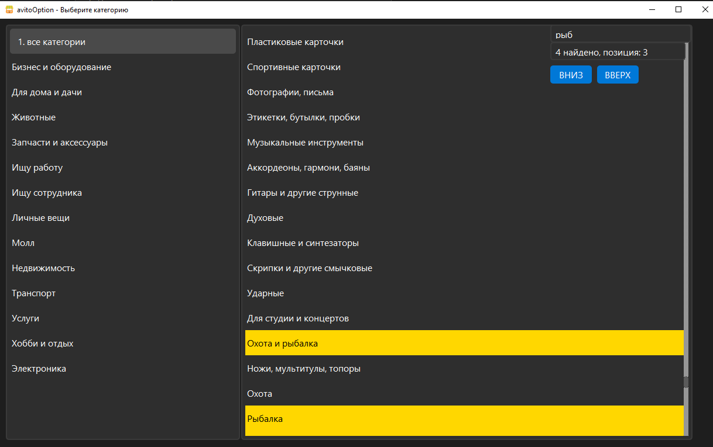
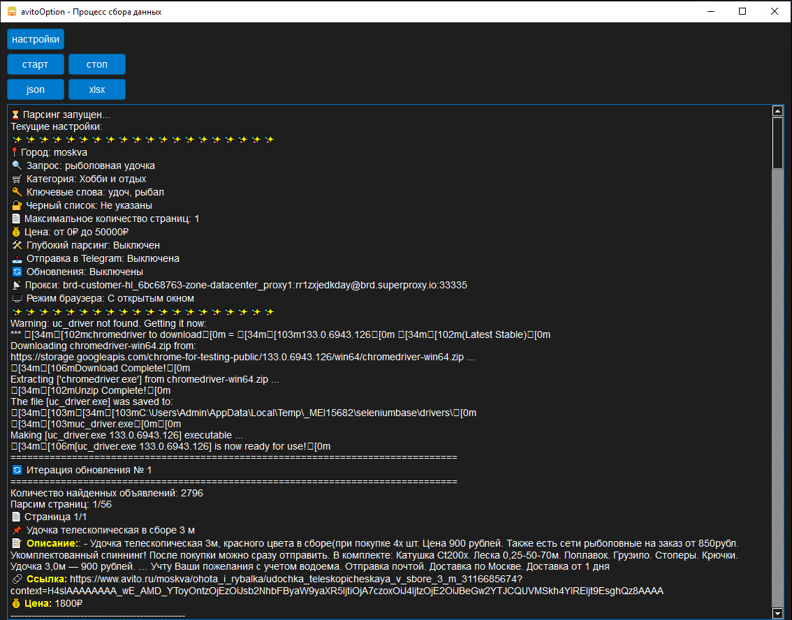

## Оглавление

- [💡 Благодарность](#-благодарность)
- [🚀 Основные возможности](#-основные-возможности)
- [🔑 Категории](#-категории)
  - [📂 Примеры категорий](#-примеры-категорий)
- [📡 Отправка данных в Telegram](#-отправка-данных-в-telegram)
- [🛠️ Установка](#installation)
- [🔧 Настройки поиска](#-настройки-поиска)
- [🌐 Настройки прокси](#-настройки-прокси)
- [🤖 Взаимодействие с Telegram](#-взаимодействие-с-telegram)
- [🚀 Управление](#-управление)
- [📂 Выбор категории](#-выбор-категории)
- [🚀 Процесс парсинга](#-процесс-парсинга)
- [📝 Рекомендации](#-рекомендации)
- [📦 Скачать скомпилированную версию](#-скачать-скомпилированную-версию)


# 🛍️ avitoOption — Парсер Avito
## 💡 Благодарность

Этот проект был вдохновлён репозиторием [parser_avito](https://github.com/Duff89/parser_avito).  
Большое спасибо автору за проделанную работу и идеи, которые вдохновили на разработку **avitoOption**! 🙌

📢 **avitoOption** — это гибкий и мощный парсер объявлений Avito, который поддерживает мониторинг, работу через прокси, отправку данных в Telegram, выбор категорий и сохранение информации в JSON/XLSX.

## 🚀 Основные возможности

- 🔹 **Обычный режим** – парсер проходит заданное количество страниц и собирает объявления.
- 🔹 **Режим мониторинга** – парсер периодически проверяет новые объявления и изменения цен.
- 🔹 **Детальный режим** – парсер заходит в карточки товаров и извлекает подробную информацию.
- 🔹 **Поддержка прокси** – рекомендуется использовать ротационные прокси с IP-адресами СНГ.
- 🔹 **Отправка уведомлений в Telegram** – передача данных в реальном времени.
- 🔹 **Выбор категорий** – возможность более точного поиска в конкретных категориях.
- 🔹 **Фильтры** – ключевые слова, черный список, ценовой диапазон, выбор города.
- 🔹 **Сохранение данных** – JSON и Excel (XLSX).
- 🔹 **Графический интерфейс** – удобное управление всеми настройками.

---

## 🔑 Категории
Для более точного поиска можно выбрать категорию **прямо в программе**.  
На момент выхода добавлены **все существующие категории Avito**.

### 📂 Примеры категорий:
- 📱 **Электроника** – `/bytovaya_elektronika`
- 🚗 **Транспорт** – `/transport`
- 🏠 **Недвижимость** – `/nedvizhimost`
- 🎣 **Охота и рыбалка** – `/ohota_i_rybalka`

---

## 📡 Отправка данных в Telegram
Чтобы получать данные о найденных объявлениях в **Telegram**, выполните следующие шаги:

1. **Создайте бота** через [@BotFather](https://t.me/BotFather).
2. **Получите API-токен** после создания бота.
3. **Узнайте ваш `chat_id`** через [@userinfobot](https://t.me/userinfobot).

--- 
<h2 id="installation">🛠️ Установка</h2>

### 🔹 1. Установка через исходный код
> **Требования:** Python 3.10+ и `pip`

```sh
git clone https://github.com/facelessAlien/avitoOption.git
cd avitoOption
python -m venv venv
source venv/bin/activate  # Для Linux/macOS
venv\Scripts\activate      # Для Windows
pip install -r requirements.txt
python avitoOption.py
```
Важно: Если при установке зависимостей возникает ошибка, связанная с seleniumbase, например:
```sh
ERROR: To modify pip, please run the following command:
C:\Python3.11.8\python.exe -m pip install seleniumbase
```
то выполните предложенную команду, в моем случае это:
```sh
C:\Users\PC\Desktop\avitoOption\venv\Scripts\python.exe -m pip install -r requirements.txt
так же команда в вашем терминале будет выделена красным цветом, просто скопируйте эту команду целиком и вставьте в терминал
```
Примечание: Путь к Python может отличаться в зависимости от директории, куда вы клонировали репозиторий.
Вам следует указать полный путь до python.exe в папке venv\Scripts данного репозитория на вашем компьютере
пример команды:
полный\путь\до\python.exe -m pip install -r requirements.txt
---
## 🔧 Настройки поиска

1. **Город поиска** – указывается транслитом, например: `moskva` для Москвы.  
2. **Текст запроса** – поисковый запрос, как если бы его вводили на сайте Avito, например: `рыболовная удочка`.  
3. **Ключевые слова** – перечень слов через запятую, например: `удоч, рыбал`. Рекомендуется указывать неполные слова для поиска по вхождению.  
4. **Черный список слов (BLACKLIST)** – объявления с указанными словами в описании будут игнорироваться.  
5. **Мин. цена** – минимальная допустимая цена товара (0 – если не важно).  
6. **Макс. цена** – максимальная допустимая цена товара (9999999999 – если не важно).  
7. **Детальные данные из карточек** – при включении парсер переходит на страницы объявлений и собирает больше информации (замедляет процесс).  
8. **Режим мониторинга** – парсер будет регулярно проверять новые объявления и изменения цен.  
9. **Интервал мониторинга** – время (в секундах) между проверками при активированном мониторинге.  
10. **Скрытый режим** – при включении работа парсера проходит без отображения окна браузера.  
11. **Интервал ожидания (антибан)** – задержка (в секундах) перед переходом к следующей странице во избежание бана по IP.  

## 🌐 Настройки прокси

12. **Формат прокси** – `логин:пароль@айпи:порт`.  
13. **Проверка прокси** – нажмите кнопку "проверить прокси", если в поле отобразился IP, значит прокси работает.  

## 🤖 Взаимодействие с Telegram

14. **Токен бота** – указывается в формате `токен::чат_айди`, важно разделять двумя `:`.  

## 🚀 Управление  

15. **Окно парсинга** – переход к следующему окну работы парсера.  
16. **Выбор категории** – открытие окна для выбора нужной категории, чтобы сузить область поиска.  
17. **Кол-во страниц для парсинга** – ограничивает парсинг только указанным числом страниц. Если страниц меньше, чем указано, будет обработано всё доступное.  

## 📂 Выбор категории

При выборе категории можно воспользоваться встроенным поиском, чтобы быстро найти нужный раздел.  



- **Левая колонка** – список основных категорий.  
- **Правая колонка** – подкатегории выбранной категории.  
- **Поле поиска** – можно ввести часть названия, и программа автоматически отфильтрует категории.
- **Кол-во вхождений** - тут кол-во найденных элементов
- **Кнопки вверх и вниз** - позволяют перемещаться по найденным элементам

После выбора категории парсер будет искать объявления только в указанном разделе.


- **JS** - добавлен новый чекбокс, если его включить, то браузер будет отключать JS на странице, это ускорит процесс, но могут возникнуть ошибки, в любой момент его можно отключить
## 🚀 Процесс парсинга



- **Кнопки управления**  
  - `Настройки` – возврат в окно настроек.  
  - `Старт` – запуск парсинга.  
  - `Стоп` – остановка работы.  
  - `JSON / XLSX` – экспорт данных в указанный формат.  

- **Лог работы**  
  - Вывод текущих параметров поиска.  
  - Информация о найденных объявлениях.  
  - Лог скачивания и работы драйвера.


  
## 📝 Рекомендации

- **Прокси:** Используйте ротационные прокси с российскими IP-адресами. Прокси из других регионов могут вызывать блокировки или ошибки доступа.
- **Режим парсинга:** После применения фильтров запускайте парсинг в открытом режиме (без скрытия браузера), чтобы увидеть предварительный результат. Это позволит скорректировать фильтры (например, по черному списку или ключевым словам) при необходимости.
- **Пауза между запросами:** Рекомендуется выставлять паузу не менее 3 секунд между переходами страниц или запросами, чтобы избежать блокировок по IP и обеспечить корректную загрузку данных.


## 📦 Скачать скомпилированную версию
- [Скачать v1.0.0](https://github.com/facelessAlien/avitoOption/releases/tag/v1.0.0)
